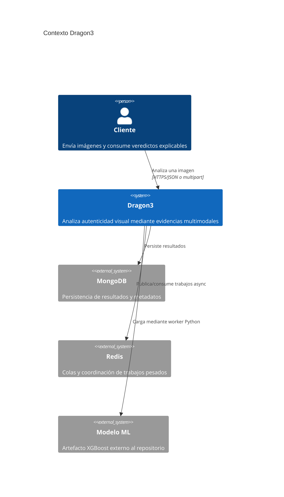
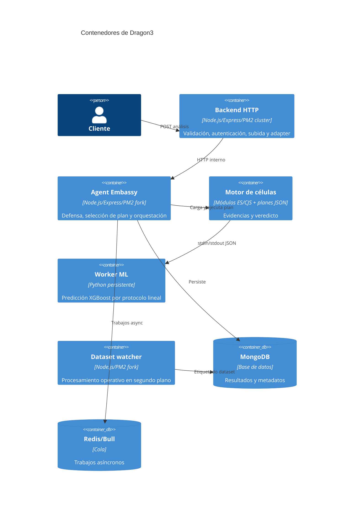
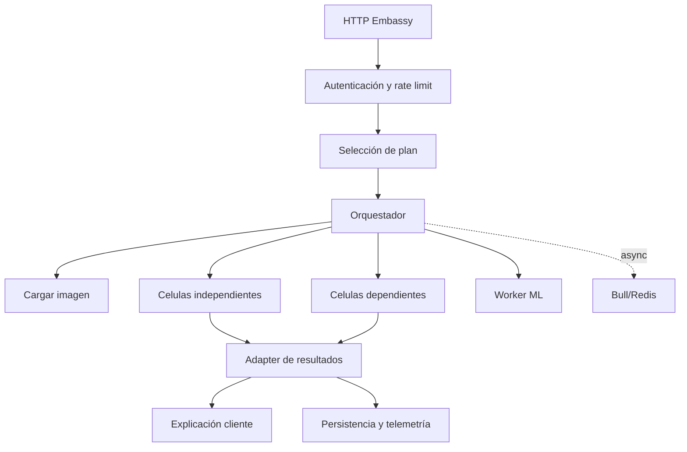
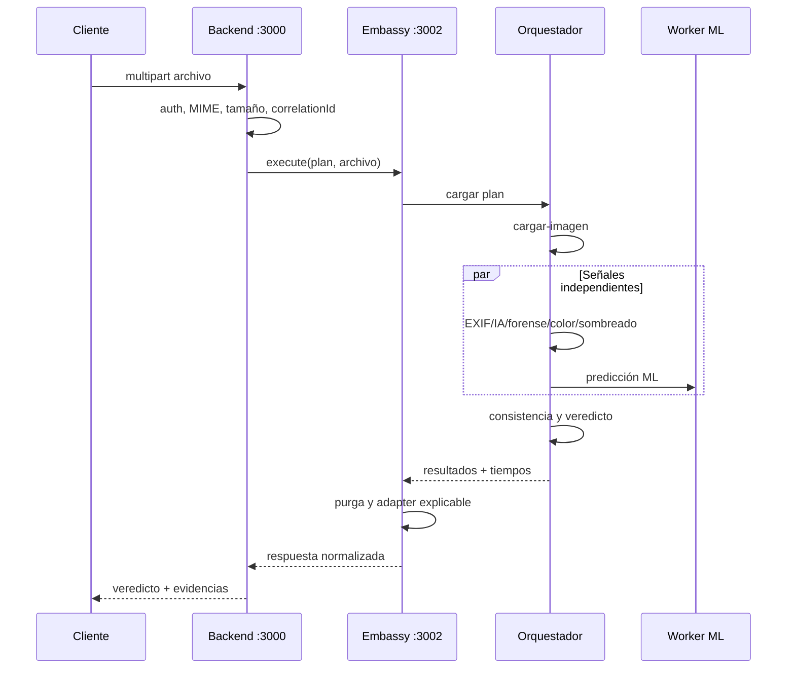

# Arquitectura C4 de Dragon3

> Fuente: configuracion PM2 y rutas de produccion. Las cifras de rendimiento son objetivos o mediciones fechadas, no garantias universales.

## Nivel 1: contexto

## Nivel 2: contenedores

## Nivel 3: componentes del Embassy

## Flujo de secuencia sincrono

## Propiedad y limites

| Componente | Ownership | Escalado actual | Estado |
|---|---|---:|---|
| Backend | HTTP/API | 2 cluster configurable | stateless salvo dependencias externas |
| Embassy | orquestación | 1 fork | mantiene worker ML y caches |
| Worker ML | inferencia | 1 por Embassy | proceso persistente |
| Dataset watcher | background | 1 fork | fuera del camino HTTP |
| MongoDB | persistencia | externo | requiere backup y monitorización |
| Redis/Bull | async | externo | no usar para hot path sincrono |

## Riesgos arquitectonicos abiertos

- El Embassy único es un punto de coordinación; multiplicarlo requiere diseñar ownership de worker ML, locks y caches.
- La ruta asincrona Bull debe exponerse mediante un contrato de job antes de usarse como API pública.
- Dev y prod son copias con riesgo de divergencia; cada release debe comparar el runtime generado.
